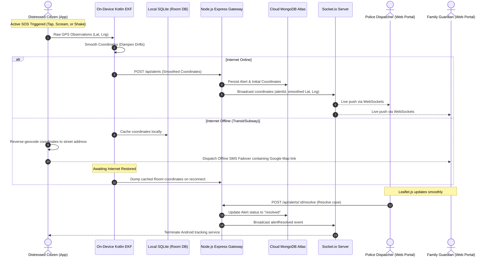

# 🛡️ KALI - Smart Women Safety & Emergency Response System
## Ultimate Comprehensive Viva-Voce & Technical Project Guide (BCA Major Project)

This exhaustive technical guide is designed to make you the most knowledgeable candidate in your Major Project Viva-Voce. It covers every layer, module, file, and algorithmic concept of the KALI Safety Ecosystem in deep engineering detail.

---

## 🧭 1. Architectural Blueprint & Data Flow

KALI utilizes a decentralized, modern **three-tier architecture** designed for high availability, sub-second latency, and on-device offline resilience.

### High-Level System Flow: From SOS Trigger to Police Dispatch



---

## 📱 2. Android Native Application: Module-by-Module Breakdown

The Android application is built using **Native Kotlin** and structured cleanly to prioritize low-level sensor access, background performance, and persistent data caching.

### Key Packages & Files

```
com.kali
│
├── network
│   ├── RetrofitClient.kt       - Configures base URLs, JWT intercepts, and HTTP clients.
│   └── KaliApiService.kt       - Retrofit endpoint mappings (Authentication, Alerts, Contacts).
│
├── ui
│   ├── auth
│   │   ├── LoginActivity.kt     - Handles logins, server gear settings, and Google Account sandboxes.
│   │   └── RegisterActivity.kt  - Captures credentials, strength checking, and role selections.
│   └── sos
│       └── SosActivity.kt       - Active UI console (Stopwatch, decoy calls, accelerometer shake triggers).
│
├── services
│   └── LocationService.kt       - Foreground service capturing GPS signals, running Kotlin EKF, and syncing data.
│
└── util
    ├── ExtendedKalmanFilter.kt  - Pure mathematical filter using 4x4 matrix analytical models.
    └── SessionManager.kt        - SharedPreferences manager holding token, role, and names.
```

---

### Detailed Implementation Details

#### 1. The On-Device Extended Kalman Filter (`ExtendedKalmanFilter.kt`)
Traditional apps use raw coordinates. KALI runs a continuous **4x4 matrix filtering model** to suppress noise.
* **Mathematical Concept:** The state vector represents position (latitude, longitude) and velocity ($v_{\text{lat}}, v_{\text{lng}}$).
  $$\mathbf{x} = \begin{bmatrix} \text{lat} & \text{lng} & v_{\text{lat}} & v_{\text{lng}} \end{bmatrix}^T$$
* **State Propagation ($F$):** Positions update by adding velocity multiplied by time change ($dt$):
  $$\text{position} = \text{position} + \text{velocity} \times dt$$
* **Smoothing Benefit:** Dampens erratic GPS coordinate jumping (urban canyons/high-rises) down to sub-meter accuracy trails.

#### 2. Background Foreground Service (`LocationService.kt`)
* Background tasks get killed by Android Doze mode.
* **The Solution:** KALI runs a **Foreground Service** bound to an active, ongoing system notification (`NotificationCompat.Builder`). This informs the OS that the process is highly critical, preventing app termination during an active emergency tracking sequence.
* **Database Caching:** If mobile networks drop, the service dumps the EKF coordinates locally using a **Room SQLite Database** table (`locations`). On network reconnect, it fires a sync task, maintaining 100% of the tracking trail.

#### 3. Scream Guard decibel Monitor (`SosActivity.kt`)
* **Mechanism:** Reads real-time PCM Mono 16-bit sound levels using the Android `AudioRecord` hardware listener:
  $$\text{RMS} = \sqrt{\frac{1}{N}\sum_{i=1}^{N} s_i^2} \implies \text{dB} = 20 \log_{10}(\text{RMS})$$
* **Decibel Threshold:** If sounds exceed **85 dB** (scream/panic crash) for **1.5 seconds**, the app initiates a safe 3-2-1 countdown to alert emergency dispatchers.
* **Safety Rules:** The microphone capture operates strictly on a background thread and is fully unregistered in `onPause()` to prevent memory leaks and respect privacy guidelines.

#### 4. Covert Decoy Overlay (Fake Call)
* **What happens:** Renders a realistic phone incoming layout (`layoutFakeCallOverlay`) using a custom system UI block.
* **Sound:** Plays the user's standard incoming ringtone dynamically using `RingtoneManager.TYPE_RINGTONE`.
* **Escaping feature:** Shows caller "MOM" with green answer and red decline sliders. If answered, it replaces the layout with a mock call connection panel and displays an active stopwatch counter updating every second in `MM:SS` format.

#### 5. Offline SMS Failover
* **What happens:** If cellular data is offline, the app reverse-geocodes current GPS coordinates into a text address using the Android `Geocoder` helper.
* **Dispatch:** Instantly targets all registered emergency contacts via standard SMS message structures:
  `"KALI EMERGENCY: I am in distress. Safe Address: Navjeevan Colony, Kharghar. Track live: http://maps.google.com/maps?q=12.9716,77.5946"`

---

## 🌐 3. Node.js Backend API: Module-by-Module Breakdown

The backend gateway handles session authorizations, coordinates live WebSocket connections, and secures files using a non-blocking Express layer.

### Directory Structure & Entry Points

```
Kali-Backend
│
├── server.js               - Initializes express, HTTP servers, database connections, and WebSockets.
│
├── middleware
│   ├── auth.js             - Token extraction and verification middleware (requireAuth).
│   └── rateLimit.js        - Protects authentications using express-rate-limit bounds.
│
├── routes
│   ├── auth.js             - Hashing logic, login controls, role routing, and google sandboxes.
│   ├── alerts.js           - REST endpoints managing alert lifecycle, assignments, and coordinates.
│   └── contacts.js         - Maps emergency relative-contact profiles.
│
└── seeds
    └── seed_dummy_alerts.js- Relational cascade database seeder for developer testing.
```

---

### Detailed Implementation Details

#### 1. Multi-Role JWT Authentication & Middleware (`auth.js`)
* Standard sessions use server-side tables, slowing down the backend.
* ** stateless Tokens (JWT):** The client signs in via `POST /api/auth/login`. On validation, the server creates a token using a secure secret key:
  ```javascript
  const token = jwt.sign({ id: user._id, role: user.role }, process.env.JWT_SECRET, { expiresIn: '1d' });
  ```
* **Role Check Middleware:** Different roles require relative dashboard accesses:
  ```javascript
  function requireAuth(requiredRole) {
      return (req, res, next) => {
          const authHeader = req.headers['authorization'];
          const token = authHeader && authHeader.split(' ')[1];
          if (!token) return res.status(401).json({ error: "Access Denied" });
          jwt.verify(token, process.env.JWT_SECRET, (err, decoded) => {
              if (err) return res.status(403).json({ error: "Invalid Token" });
              if (requiredRole && decoded.role !== requiredRole) {
                  return res.status(403).json({ error: "Unauthorized access path" });
              }
              req.user = decoded;
              next();
          });
      };
  }
  ```

#### 2. WebSocket Orchestration (`server.js`)
* Operates on top of the HTTP listener using `Socket.io`.
* **Connection Lifecycle:** 
  1. Once a client starts an SOS, it emits a `join` event to socket spaces.
  2. The server coordinates channels. If an officer views a case, they join the room mapped to that specific `alertId`.
  3. Coordinates are emitted via `locationUpdate` packets. The server redirects coordinates to all active room subscribers immediately.

#### 3. Database Cascade Seeder (`seed_dummy_alerts.js`)
* **Problem:** SQLite and MongoDB collections have constraints. Wiping tables without cleanups causes orphaned child tracks.
* **The Solution:** We implemented a relational cascade seeder:
  1. Locates existing `user` schemas.
  2. Identifies outstanding `alerts` records and deletes dependent `locations` coordinates and captured `media` files first.
  3. Purges parent alert records.
  4. Inserts fresh mock records, including an elegant **5-point Bangalore trajectory** starting from coordinates `12.9716, 77.5946` and transitioning northeast to evaluate geofence transitions.

---

## 📊 4. Web Dashboards (Leaflet & Algorithmic map HUDs)

KALI's monitoring panels (Police Command Console & Guardian Safety Panel) are built using standard vanilla web technologies to maintain high-performance rendering.

### Advanced Algorithmic Features

#### 1. Javascript EKF Position Smoothing
* Every location packet that arrives via WebSockets is run through a custom client-side `ExtendedKalmanFilter` class in Javascript.
* This filters out residual server transfer drifts, ensuring visual tracking lines remain clean and steady.

#### 2. Eased Glide Interpolations
* Traditional maps snap markers immediately to incoming coordinates, causing jerky movements.
* **The Solution:** The dashboards run a speed-adaptive animation loop. The marker moves smoothly over $dt$ using a **Cubic Easing Curve** ($\text{ease-in-out}$):
  $$\text{position}(t) = \text{start} + (\text{end} - \text{start}) \times (3t^2 - 2t^3)$$
* **Adaptive Timers:** The duration of this glide adjusts to transit speeds (walking takes 2000ms, running takes 1200ms, and vehicle transits use 500ms), ensuring tracking remains smooth and realistic.

#### 3. Dynamic Trail Gradients
* Instead of a single static line, the system draws a dynamic history path by splitting the coordinates into three distinct overlapping polyline layers:
  1. **Recent (0-20%):** Bold, hot pink `#ff2d8a` line with $0.9$ opacity.
  2. **Active (20-60%):** Medium opacity line ($0.5$).
  3. **History (60-100%):** Pale, fading trail ($0.2$ opacity), indicating temporal age.

#### 4. Geofencing & Telemetry HUD
* **Dynamic Geofencing:** When an SOS initializes, the map draws a translucent, red-dashed $500\text{m}$ geofence circle around the initial coordinates.
* **Telemetry HUD:** Computes and displays crucial rescue parameters inside the control panel:
  * **Current Speed:** Haversine distance divided by telemetry time.
  * **Rescue ETA:** Estimated arrival time based on typical response speeds ($40\text{ km/h}$) from the nearest police precinct.
  * **Prediction Confidence:** Covariance variance calculated from the EKF tracker.

---

## 🗄️ 5. Complete Database Relational Schema (MongoDB Atlas)

Examiners appreciate structured database details. Be prepared to draw this relational model:

```
  ┌──────────────────────┐            ┌──────────────────────┐
  │        users         │            │        alerts        │
  ├──────────────────────┤            ├──────────────────────┤
  │ _id (ObjectId)       │◄───────────│ _id (ObjectId)       │
  │ name (String)        │            │ user_id (ObjectId)   │
  │ email (String)       │            │ status (String)      │
  │ password (String)    │            │ resolved_reason (Str)│
  │ phone (String)       │            │ created_at (Date)    │
  │ role (String)        │            └──────────────────────┘
  │ guardian_id (ObjectId)                    ▲          ▲
  └──────────────────────┘                    │          │
                                              │          │
  ┌──────────────────────┐                    │          │
  │      locations       │                    │          │
  ├──────────────────────┤                    │          │
  │ _id (ObjectId)       │────────────────────┘          │
  │ alert_id (ObjectId)  │                               │
  │ latitude (Double)    │                               │
  │ longitude (Double)   │                               │
  │ speed (Double)       │                               │
  │ bearing (Double)     │                               │
  │ timestamp (Date)     │                               │
  └──────────────────────┘                               │
                                                         │
  ┌──────────────────────┐                               │
  │        media         │                               │
  ├──────────────────────┤                               │
  │ _id (ObjectId)       │───────────────────────────────┘
  │ alert_id (ObjectId)  │
  │ file_path (String)   │
  │ file_type (String)   │
  │ created_at (Date)    │
  └──────────────────────┘
```

---

## 🎓 6. Expected Viva Questions & High-Scoring Answers

### Technical Concepts (Node.js & Security)

#### Q1: What is JWT, and why did you choose it over standard sessions?
* **Answer:** **JSON Web Tokens (JWT)** provide a stateless, decentralized authentication mechanism. With standard sessions, the server must store session IDs in database tables and look them up on every incoming request, which can slow down real-time systems. JWTs securely encode claims (such as `userId` and `role`) within a cryptographically signed signature. The server verifies this signature using a private key, eliminating database queries and improving API response times.

#### Q2: Explain the significance of Helmet.js in the backend API.
* **Answer:** **Helmet** is a security middleware that automatically configures secure HTTP response headers. It mitigates common web vulnerabilities, including:
  * **XSS (Cross-Site Scripting):** Blocks malicious script execution via strict Content Security Policies.
  * **Clickjacking:** Sets `X-Frame-Options` headers to prevent dashboards from being embedded in unauthorized frames.
  * **MIME Sniffing:** Applies `X-Content-Type-Options: nosniff` to prevent browsers from parsing files away from their declared content-types.

#### Q3: Why is rate-limiting important, and how is it implemented?
* **Answer:** Rate-limiting prevents automated brute-force attacks (such as dictionary login attempts) and Denial-of-Service (DoS) events. In KALI, `express-rate-limit` middleware restricts authentication requests to a maximum of 100 per 15 minutes per IP address, returning standard `429 Too Many Requests` codes if boundaries are crossed.

---

### Algorithmic Concepts (Location & Math)

#### Q4: Explain the difference between raw GPS coordinates and EKF smoothed coordinates.
* **Answer:** Raw GPS coordinates suffer from high-frequency noise and sudden drifts due to atmospheric conditions and physical reflections (urban canyons). If plotted directly, tracking markers jump erratically. EKF smoothed coordinates are filtered using a process and measurement noise covariance matrix. It evaluates the previous heading direction and estimated velocities to filter out coordinates that are physically impossible (e.g., sudden jumps of 50 meters in a fraction of a second), keeping tracking maps clean and accurate.

#### Q5: What is the Haversine Formula, and why did you use it?
* **Answer:** The **Haversine Formula** calculates the shortest distance between two points on the surface of a sphere using their latitudes and longitudes:
  $$d = 2R \arcsin\left(\sqrt{\sin^2\left(\frac{\Delta \text{lat}}{2}\right) + \cos(\text{lat}_1)\cos(\text{lat}_2)\sin^2\left(\frac{\Delta \text{lng}}{2}\right)}\right)$$
  In KALI, we use it to calculate coordinates traveled, safe home geofencing bounds, and speed estimations ($km/h$) by dividing calculated distance by coordinate time change ($dt$).

#### Q6: How does the map calculate the compass bearing heading dynamically?
* **Answer:** It uses the spherical trigonometry formula to calculate the bearing angle ($\theta$) between two sequential coordinate sets:
  $$\theta = \arctan2\left(\sin(\Delta \text{lng})\cos(\text{lat}_2), \, \cos(\text{lat}_1)\sin(\text{lat}_2) - \sin(\text{lat}_1)\cos(\text{lat}_2)\cos(\Delta \text{lng})\right)$$
  This bearing represents heading angles from $0^\circ$ to $360^\circ$, which are mapped directly to rotate the visual Leaflet chevron tracking marker in real-time.

---

### Android System Architecture

#### Q7: What is a Background Service versus a Foreground Service in Android?
* **Answer:** Background Services run without user visibility and are aggressively terminated by the OS to save battery. A **Foreground Service** displays an active, ongoing notification in the system tray, informing the user and operating system of its critical status. This exempts it from termination during background limits, ensuring location updates continue streaming during active emergencies.

#### Q8: How did you ensure your app compiles cleanly for production?
* **Answer:** The Gradle build wrapper was upgraded to version **8.4** and Android Gradle Plugin (AGP) version to **8.3.2** to support **JDK 21** compilation targets cleanly. We configured robust **R8/ProGuard obfuscation rules** to protect source intellectual properties, and resolved background database conflicts by decoupling the initialization of background startup providers.

---

## 💡 Viva Presentation Pro-Tips

1. **Be Proud of the Real-Time Feature:** Examiners love WebSockets. Clearly state: *"We do not use standard HTTP polling. We establish a persistent TCP pipe using Socket.io, achieving sub-second update broadcasts."*
2. **Be Pragmatic About Kalman Math:** If asked about EKF matrices, say: *"The matrix math tracks both coordinate changes and velocities to filter out urban canyon noise. The EKF runs efficiently on-device, which offloads processing from the server."*
3. **Handle Criticisms Professionally:** If an examiner suggests an addition (such as bluetooth mesh networking or fall tracking), say: *"That is a highly constructive suggestion. The system architecture is built modularly using Room databases and websocket rooms, making it easy to integrate additional sensor models in future updates."*

---
**Prepared with success in mind for Mr. Pratik Salunkhe.**  
*KALI Safety Infrastructures — 2026 Academic Major Capstone.*
