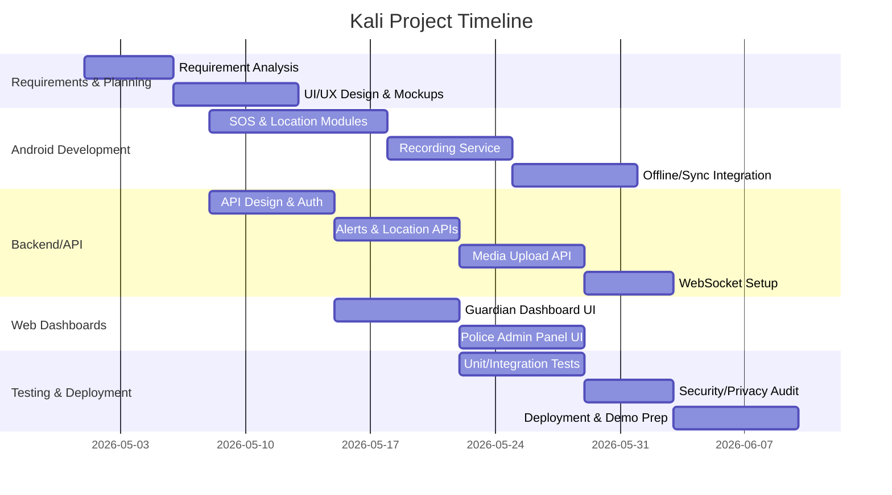

# Kali: Women’s Safety App – End-to-End Project Documentation

## Approach and Scope  
We will:  
- **Gather and consolidate** all KALI requirements and features from prior discussions.  
- **Design the complete system**, including architecture, database schema, and evidence flow.  
- **Define modular components**: code folder structure, API contracts, and UI/UX screens.  
- **Compile detailed documentation** covering every feature and implementation step.  
- **Prepare viva/demo artifacts**: diagrams, Q&A, and deployment guides.  

This document presents a comprehensive plan for Kali, a mobile+web safety system. It covers user flows, features, system design, security, and implementation, ensuring a rigorous and complete project suitable for a final-year project or proof-of-concept demo.

## User Profiles & Flow  

- **Victim (Android App User):** Carries the Kali app. On an emergency, she triggers SOS (via UI or automatic detection). The app records her GPS path and evidence (audio/video) continuously.  
- **Guardian (Family/Friend):** Logs into the web portal. Upon an alert, they see the victim’s live location on a map, receive notifications, and access uploaded evidence.  
- **Police/Staff (Admin):** Logs into the admin panel (web or mobile). They monitor all active cases, assign officers, and oversee response.  

**Role-Based Interfaces:** Kali supports three main interfaces: the **Evidence App** (victim’s Android app), the **Family Dashboard** (web portal for guardians), and the **Police/Admin Portal** (web or mobile interface for law enforcement). The backend encodes each user’s role in the authentication token. Thus, after login, the client app or web page routes users to the appropriate UI. For example, if a police officer logs into the Android app with their credentials, the app detects `role=Admin` and immediately shows the police interface (case list, assignment tools) instead of the SOS screen. Guardians see a tracking/dashboard view, and victims see the SOS/evidence screen. All interfaces share the same backend data, so events propagate across app and web in real time (e.g. an alert from the app appears on both the guardian and police dashboards simultaneously).  

**Basic Flow:** A victim activates SOS → App captures GPS & recordings locally → Backend sends alerts to guardians/police → WorkManager syncs data to cloud → Guardians/Police view alert on web, access media. This covers alerting, data collection, and monitoring in one end-to-end flow.

## Key Features  

### Core Functionality  
- **SOS Alert & Notification:** One-tap SOS sends an emergency request to the server. Trusted contacts and the admin portal are alerted via push notifications. The alert includes the user’s ID and timestamp.  
- **Real-time GPS Tracking:** While an alert is active, the victim’s phone sends periodic location updates. Guardians see the moving marker on a map.  
- **Hidden Audio/Video Evidence:** Immediately upon SOS, the app starts background recording via `MediaRecorder`. It saves audio (microphone) and optionally video (camera) to files in encrypted storage. This “digital witness” recording is invaluable for proof【39†L353-L355】【38†L69-L73】.  
- **Offline-First Operation:** All data (alerts, locations, media) are queued locally in an internal SQLite (Room) database. The app functions fully without internet (creating alerts and recordings locally). When connectivity returns, all data is uploaded. This ensures reliability in remote or blocked areas.  
- **Auto Cloud Sync:** A background worker (WorkManager) uploads pending data to the cloud (Firebase or custom server) whenever network permits. Users see “Syncing…” status until complete.  
- **Authentication:** Secure login system (JWT tokens or Firebase Auth). Stores hashed passwords. Roles (“User”, “Guardian”, “Admin”) define UI.  
- **Guardian Web Dashboard:** Upon login, family members see the map with victim’s location, a list of active/resolved cases, and a gallery of evidence (playable audio/video clips). They can add notes or escalate to police if needed.  
- **Police/Admin Panel:** Law enforcement can log in to view **all** incoming alerts. They see victim details, location history, and evidence. They assign nearby officers via the interface.  

### Advanced / Novel Features  
- **AI-Triggered SOS:** The app includes on-device audio analysis. Using TensorFlow Lite (e.g. Google’s YAMNet model) we detect high-decibel screams【27†L140-L148】【28†L73-L80】. If a scream or loud distress sound is recognized (above a confidence threshold), the app auto-activates SOS after a short warning (to prevent false alarms). Similarly, a sudden fall pattern from accelerometer can trigger an alert. This turns KALI into a proactive safety system, not just a reactive app.  
- **Hands-Free Activation:** Users can configure alternate triggers: double-press power button, voice command, or a connected wearable. This allows discreet alerts even if the phone is not in hand.  
- **Proof and Security:** All evidence files are treated as immutable. We implement append-only storage and cryptographic hashes. For instance, audio/video files are uploaded with metadata including a SHA-256 hash. Any alteration (even deletion attempts) can be detected【35†L120-L129】.  
- **Privacy Modes:** A “decoy mode” hides the app’s purpose (e.g. showing benign UI) when activated, preventing attacker detection.  

### Features Omitted or Limited  
- **Permanent Undeletability:** We respect user rights. Though eBodyGuard advertises “records that cannot be deleted”【38†L69-L73】, truly preventing deletion conflicts with privacy laws. Instead, KALI logs all actions in an audit trail: data can be deleted upon request, but an irreversibly hashed log entry will indicate its existence【35†L120-L129】.  
- **Continuous Officer Streaming:** While some systems consider officer tracking, requiring continuous screen/audio capture from responders is impractical (and privacy-invasive). We instead log assignments and status updates with timestamps for accountability.  
- **Third-Party Dependencies:** The design avoids over-reliance on external police systems; instead, it simulates dispatch through the admin portal.  

## System Architecture  

```mermaid
graph LR
    subgraph Android App (Kotlin)
        UI[SOS / Home / Settings UI] --> VM[ViewModel]
        VM --> Repo[Repository]
        Repo -->|Room| LocalDB[(Local SQLite)]
        Repo -->|REST API| Backend
        UI --> LocSvc(LocationService)
        UI --> RecSvc(RecordingService)
    end
    subgraph Web App (HTML/CSS/JS)
        GLogin[Guardian Login] -->|Auth| Backend
        GDash[Guardian Dashboard] -->|API| Backend
        PLogin[Police Login] -->|Auth| Backend
        PPanel[Police Admin Panel] -->|API| Backend
    end
    subgraph Backend Server
        AuthCtrl(Authentication)
        AlertCtrl(Alerts API)
        LocCtrl(Locations API)
        MediaCtrl(Media API)
        AdminCtrl(Assignment API)
        AuthCtrl --> UsersDB[(Users Table)]
        AlertCtrl --> AlertsDB[(Alerts Table)]
        LocCtrl --> LocationsDB[(Locations Table)]
        MediaCtrl --> MediaDB[(Media Table)]
        AdminCtrl --> AlertsDB
        AlertCtrl --> WebSocket[(Socket.IO)]
    end
    Android App -- HTTPS/WebSocket --> Backend
    Web App -- HTTPS/WebSocket --> Backend
    Backend -- Database --> MainDB[(SQL/NoSQL DB)]
    Backend -- Storage --> Cloud[(Firebase Storage/S3)]
```

- **Android App Modules:** Following MVVM, the app has UI screens (Activity/Fragment for SOS, contacts, settings) bound to ViewModels. Repositories mediate between local Room DB and remote APIs. Background tasks:  
  - *LocationService:* Runs in foreground to capture GPS; writes to local DB.  
  - *RecordingService:* Foreground service to capture media; saves encrypted files.  
  - *SyncWorker:* Periodic WorkManager job uploads pending entries.  

- **Web Apps:** Two web interfaces. Both share the same backend.  
  - *Guardian Portal:* Accessible after login. Shows map (Google Maps API) with the victim’s live path, an alert history panel, and evidence gallery. Uses REST APIs and listens to WebSocket events for live updates.  
  - *Police/Admin Portal:* After login, lists all active alerts across the system. Admins can click a case to view details (victim info, evidence, location timeline) and assign officers. This panel also uses WebSockets to receive new alerts immediately (real-time alert stream).  

- **Backend Options:**  
  - *Node.js/Express:* We implement custom REST endpoints. Uses libraries for JWT authentication. Data stored in a relational DB (PostgreSQL/MySQL) or MongoDB. Media files are stored in AWS S3 or Firebase Storage. Socket.IO handles real-time messaging【30†L74-L83】.  
  - *Firebase Alternative:* Use Firebase Auth (handles login), Firestore (collections for users/alerts), Cloud Functions (serverless API), and Firebase Storage (files). Firestore’s offline persistence automatically caches data【45†L1520-L1527】. Realtime listeners replace custom WebSockets. This option simplifies deployment but ties us to Google’s ecosystem.  

Regardless of choice, the APIs and data contracts remain the same for clients. The key is one common backend that syncs the Android and web clients.

## Database Schema  

```mermaid
erDiagram
    USERS {
        int id PK
        string name
        string email
        string phone
        string password_hash
        string role  -- 'User','Guardian','Admin'
    }
    ALERTS {
        int id PK
        int user_id FK
        datetime timestamp
        string status  -- 'active','resolved'
    }
    LOCATIONS {
        int id PK
        int alert_id FK
        double lat
        double lng
        datetime timestamp
    }
    MEDIA {
        int id PK
        int alert_id FK
        string file_url
        string media_type  -- 'audio','video','image'
        string upload_status  -- 'pending','uploaded'
        datetime timestamp
    }
    USERS ||--o{ ALERTS : "initiates"
    ALERTS ||--o{ LOCATIONS : "logs"
    ALERTS ||--o{ MEDIA : "stores"
```

**SQL Tables:**  

```sql
CREATE TABLE users (
  id SERIAL PRIMARY KEY,
  name VARCHAR(100),
  email VARCHAR(100) UNIQUE NOT NULL,
  phone VARCHAR(20),
  password_hash VARCHAR(255) NOT NULL,
  role VARCHAR(20) NOT NULL  -- e.g. 'User', 'Guardian', 'Admin'
);
CREATE TABLE alerts (
  id SERIAL PRIMARY KEY,
  user_id INT REFERENCES users(id),
  timestamp TIMESTAMP DEFAULT CURRENT_TIMESTAMP,
  status VARCHAR(20) DEFAULT 'active'
);
CREATE TABLE locations (
  id SERIAL PRIMARY KEY,
  alert_id INT REFERENCES alerts(id),
  latitude DOUBLE PRECISION,
  longitude DOUBLE PRECISION,
  timestamp TIMESTAMP DEFAULT CURRENT_TIMESTAMP
);
CREATE TABLE media (
  id SERIAL PRIMARY KEY,
  alert_id INT REFERENCES alerts(id),
  file_url TEXT,
  media_type VARCHAR(10),
  upload_status VARCHAR(10) DEFAULT 'pending',
  timestamp TIMESTAMP DEFAULT CURRENT_TIMESTAMP
);
```

- **Normalization:** Each user can create many alerts; each alert has multiple locations and media.  
- **Indices:** We index `user_id`, `alert_id`, and `timestamp` columns for efficient queries.  
- **Offline Mirror:** On-device Room DB mirrors these tables. The `upload_status` column helps track which media have been synced.

## API Endpoints  

All endpoints accept/return JSON. Protected routes require an `Authorization: Bearer <JWT>` header.

1. **Authentication:**  
   - `POST /api/register` – Registers new user. *Body:* `{name, phone, email, password}`.  
   - `POST /api/login` – User login. *Body:* `{email, password}`. *Response:* `{ token: "<JWT>" }`. (The JWT payload includes `userId` and `role`.)

2. **Alerts:**  
   - `POST /api/alerts` – Create alert. *Body:* `{latitude, longitude}`. *Response:* `{"alert_id":123,"status":"active"}`.  
   - `GET /api/alerts/:id` – Get alert info (guardians/admins only).  
   - `GET /api/alerts?user_id=XYZ` – List alerts for a user.  

3. **Locations:**  
   - `POST /api/locations` – Add location. *Body:* `{alert_id, latitude, longitude}`.  
   - `GET /api/locations/:alert_id` – Get all locations for that alert.  

4. **Media (Evidence):**  
   - `POST /api/media` – Upload file (multipart). Fields: `alert_id`, `media_type`; file: `file`. *Response:* `{file_url: "..."}`.  
   - `GET /api/media/:alert_id` – List media entries (`file_url`, `media_type`, etc.).  

5. **Admin Actions (role=Admin):**  
   - `POST /api/alerts/:id/assign` – Assign officer. *Body:* `{officer_id}`.  
   - `POST /api/alerts/:id/resolve` – Mark as resolved.  

**Authentication Middleware (Node.js example):**  
```js
const jwt = require('jsonwebtoken');
function authenticateToken(req, res, next) {
  const token = req.headers['authorization']?.split(' ')[1];
  if (!token) return res.sendStatus(401);
  jwt.verify(token, JWT_SECRET, (err, payload) => {
    if (err) return res.sendStatus(403);
    req.user = { id: payload.userId, role: payload.role };
    next();
  });
}
```

On the client side, after login, store the JWT securely (e.g. in memory or secure storage) and attach it to each request. The app/web checks `payload.role` to direct to the appropriate interface (as discussed above).

## Offline-First Sync (WorkManager)  

We implement an offline-capable architecture as recommended by Android’s official guidance【11†L1033-L1038】.  

- **Local Queue:** All writes go to Room DB first. For example, when SOS is pressed, we insert an `Alert` row and start recording. GPS points are inserted as `Locations`, and any recorded file gets a `Media` entry with `upload_status='pending'`.  
- **WorkManager Sync:** A `SyncWorker` (OneTime or PeriodicWorkRequest) monitors connectivity. When network is available, it iterates over pending records and calls the APIs. Successful uploads mark rows as synced (or delete local media files). Failed uploads (e.g. poor network) return `Result.retry()`. WorkManager survives app restarts and enforces retry with backoff【11†L1033-L1040】.  

Kotlin snippet for WorkManager:  
```kotlin
class SyncWorker(context: Context, params: WorkerParameters) : CoroutineWorker(context, params) {
  override suspend fun doWork(): Result {
    try {
      val pendingAlerts = localDb.alertDao().getPendingAlerts()
      for(alert in pendingAlerts) {
        api.createAlert(alert) // call POST /alerts
        localDb.alertDao().markUploaded(alert.id)
      }
      // similarly for locations and media...
      return Result.success()
    } catch(e: Exception) {
      return Result.retry()
    }
  }
}
```

- **Firebase Offline:** If using Firebase Realtime Database or Firestore, offline persistence is built-in【45†L1520-L1527】. Firestore automatically caches writes and syncs on reconnect. We still use WorkManager to handle file uploads.  

- **Conflict Resolution:** Since only one source (the victim’s device) writes each alert case, simultaneous edits are rare. If multiple writes happen to the same document in Firestore, the **last write wins**【45†L1525-L1527】. We simply timestamp events and accept that final state.  

## Secure Evidence Handling  

- **Encrypted Storage:** Before saving recordings, we encrypt them with AES. The key is stored in Android Keystore【22†L159-L164】, preventing unauthorized decryption.  
- **Foreground Recording:** On Android 9+, microphone access requires a foreground service【42†L759-L762】. Our `RecordingService` uses `startForeground()` with a silent notification. This complies with OS policies and keeps recording stable.  
- **Cloud Upload Flow:** WorkManager uploads files to cloud storage. We generate unique filenames (e.g. `user_alert_timestamp.mp4`). On success, we record the returned URL in the `media` table. Local encrypted files can be optionally deleted afterward to save space.  
- **Immutability & Auditing:** All data writes are append-only. We never overwrite an existing media entry. We also maintain an `AuditLog` table: `{id, alert_id, action, timestamp, user_id}`. Each record is hashed. Altering any log breaks the chain【35†L120-L129】. This ensures proof of actions (e.g. when an alert was resolved or an assignment made).  
- **Data Retention:** Victims may request deletion. We will delete personal data and media upon request, but leave a hashed audit trail.【48†L129-L134】【33†L150-L154】. This balances GDPR rights (consent and deletion) with legal needs for evidence. For example, the Tea app deleted selfies after use【33†L150-L154】, a practice Kali can emulate to protect privacy.  

## AI-Based Safety Features  

- **Scream Detection (Audio):** KALI includes an offline sound classifier. We leverage TensorFlow Lite with a model trained to recognize screams. Google’s YAMNet model or a custom model (e.g. via Teachable Machine) can classify live audio【27†L140-L148】【28†L73-L80】. The app captures short audio samples; if a scream is detected above a threshold, it auto-triggers SOS. We label this feature “AI Alert”. Performance is measured by accuracy on a test dataset (precision of actual screams vs false positives).  
- **Fall/Shake Detection:** We also monitor the accelerometer. A spike above a set G-force (e.g. >2g) suggests a fall or physical struggle. A confirmation dialog (e.g. “Are you OK?”) avoids false alarms.  
- **Model Handling:** The ML models run fully on-device (no internet required). We store the model in the app assets. Using TensorFlow Lite ensures low latency.  

These AI triggers make the app more autonomous. In practice, we test them (e.g. play screech sounds into the mic) to verify they reliably trigger SOS. These features are prototypes but add cutting-edge value.

## Real-Time Updates  

To keep all parties in sync, we implement real-time communication:  

- **WebSockets (Node + Socket.IO):** The backend uses Socket.IO to push updates. When the app creates a new alert, the server emits a `newAlert` event to connected guardians/police. Likewise, on each location update, a `locationUpdate` event is sent. A LogRocket tutorial confirms Socket.IO’s suitability for realtime location apps【30†L74-L83】. On the client side, the dashboard subscribes to these events and updates the UI without polling.  
- **Firebase Realtime (Alternative):** If using Firebase, we could use Realtime Database or Firestore listeners. For example, a child of `/alerts` triggers on value change, automatically updating connected clients. 

In either case, the Web and App remain tightly connected. When the victim’s app uploads data, the web portals see changes immediately. Conversely, admin actions (like “Resolve Alert”) sent from web cause the app to receive a WebSocket notification that the case is closed.

## Scalability & Performance  

- **Backend Scaling:** Use stateless servers behind a load balancer (e.g. Google Cloud, AWS) to handle many users. If Node.js, spawn multiple instances; if Firebase, scaling is managed automatically.  
- **Database:** For high load, a managed SQL DB or Firestore handles large datasets. Firestore partitions data across regions. We avoid heavy JOINs or complex transactions.  
- **Media Storage:** Cloud Storage (Firebase or S3) scales to millions of objects. Set lifecycle rules to archive or delete old evidence if needed.  
- **Message Throughput:** Socket.IO can scale with Redis (if many clients). Firebase scales by design.  

With no specific budget limit, we assume Cloud deployment. The architecture ensures that adding more users or devices does not degrade the core functionality.

## Privacy & Legal Compliance  

- **GDPR / Consent:** KALI requires explicit consent for recording. Users are informed when SOS is activated. We comply with GDPR’s strict rules: consent must be specific and revocable【48†L78-L80】. We store minimal PII.  
- **Data Minimization:** We only record audio/video during alerts, not continuously. Location tracking can be turned off in settings outside emergencies.  
- **Retention Policy:** Aligned with regulations, evidence is kept only as long as necessary. For example, after a case is resolved and time passes (e.g. 30 days), we can anonymize or delete data, per policy【48†L129-L134】.  
- **Security Standards:** We follow OWASP Mobile Top 10. No sensitive data (like raw audio or passwords) is logged【22†L159-L164】. All storage is encrypted. We protect against injection and XSS on the web side.  
- **Incident Example:** Note the Tea safety app breach where 72k images leaked from Firebase【33†L139-L147】. We avoid such risks by strict security rules and limited retention.  

## Testing Plan and Viva Preparation  

**Functional Testing:** Write unit and integration tests for:  
- Alert creation and location updates (API endpoints).  
- Database operations (Room DAO tests).  
- Offline mode scenarios (airplane mode stress test).  
- UI flows (Espresso for Android, Selenium/Cypress for web).  

**Security Testing:** Use OWASP ZAP or Burp to test web endpoints. Verify JWT enforcement and CORS. Check for insecure data storage with mobile scanning tools.  

**Performance Testing:** Simulate many concurrent alerts (JMeter or similar) to test server scaling and DB performance.

**Edge Cases:** Test when a phone has no GPS or no camera/mic permission. Test simultaneous logins (guardian and police see same event).  

**Viva Q&A (Sample Questions):**  
- *Q:* Why use WorkManager instead of just threading? *A:* WorkManager handles persistent background tasks and respects system constraints【11†L1033-L1040】.  
- *Q:* How do you ensure audio recording in background? *A:* We use a foreground service, required by Android 9+【42†L759-L762】.  
- *Q:* How is evidence tamper-proof? *A:* We store hashes and use append-only logs【35†L120-L129】; altering a file is detectable.  
- *Q:* How do you handle user data deletion vs immutability? *A:* We allow user-requested deletion of personal data, but keep a minimal audit record (hashed)【48†L129-L134】.  
- *Q:* Why two dashboards (family vs police)? *A:* They have different needs: family sees only their member, police sees all cases.  
- *Q:* How is data synced in real time? *A:* Via Socket.IO WebSockets (or Firebase listeners)【30†L74-L83】 for instant updates.  

Preparing answers like these will demonstrate understanding of design trade-offs and compliance.

## Implementation Roadmap  



- **Milestones:** By early June, core features (SOS, tracking, recording) will be implemented. Mid June: web dashboards and APIs. Late June: testing, security review, and demo polish.  
- **Resources:** Android Studio, Kotlin libraries (Jetpack, MediaRecorder, WorkManager), Google Maps API, Node.js (or Firebase Console), PostgreSQL/MySQL (or Firebase), Socket.IO, TensorFlow Lite, Postman, OWASP ZAP, and front-end frameworks (e.g. Bootstrap, React).  

## Technical Trade-Offs  

| Aspect             | Option A                            | Option B                            | Trade-offs |
|--------------------|-------------------------------------|-------------------------------------|------------|
| **Backend**        | Node.js + Express + SQL/NoSQL       | Firebase Cloud Functions + Firestore| *Node.js:* Full control, explicit coding of logic, easier to demonstrate server skills. *Firebase:* Quick setup, built-in auth/offline, but vendor lock-in. |
| **Database**       | PostgreSQL/MySQL (Relational)       | Firestore/MongoDB (NoSQL)           | *SQL:* Strong schema, complex queries. *NoSQL:* Flexible schema, automatic scaling/offline cache【45†L1520-L1527】, but more developer effort to enforce relations. |
| **Auth**           | JWT (custom)                        | Firebase Authentication             | *JWT:* Standard REST auth, portable. *Firebase Auth:* Supports social logins, simple client setup, but external dependency. |
| **Sync Method**    | WorkManager + REST/WebSockets       | Firestore Offline + Realtime DB     | *WorkManager:* Good for on-demand sync【11†L1033-L1038】. *Firestore:* Auto-sync, less code, but must use Firestore API. |
| **Realtime**       | Socket.IO (WebSocket)              | Firebase Realtime Database          | *Socket.IO:* Full control, cross-platform, requires managing servers. *Firebase RTDB:* Auto scale, easy listeners, limited querying. |
| **Storage Encryption** | Android Keystore + AES        | Plain internal storage (not secure) | *AES:* Secure even if device stolen【22†L159-L164】. *None:* Simpler but risk of data exposure. |

Additional comparisons (e.g. hosting providers, map APIs, frontend frameworks) are made during detailed planning; choices above cover the core technical crossroad decisions.

## Code Snippets (Critical Parts)

### Android Recording Service (Kotlin)  

```kotlin
class RecordingService : Service() {
    private lateinit var mediaRecorder: MediaRecorder
    private lateinit var outFile: File

    override fun onStartCommand(intent: Intent, flags: Int, startId: Int): Int {
        // Prepare encrypted output file path
        outFile = File(applicationContext.filesDir, "evidence_${System.currentTimeMillis()}.mp4")
        mediaRecorder = MediaRecorder().apply {
            setAudioSource(MediaRecorder.AudioSource.MIC)
            setVideoSource(MediaRecorder.VideoSource.CAMERA)
            setOutputFormat(MediaRecorder.OutputFormat.MPEG_4)
            setAudioEncoder(MediaRecorder.AudioEncoder.AAC)
            setVideoEncoder(MediaRecorder.VideoEncoder.H264)
            setOutputFile(outFile.absolutePath)
            prepare()
            start()
        }
        // Start in foreground to maintain recording
        startForeground(123, createNotification())
        return START_STICKY
    }

    override fun onDestroy() {
        mediaRecorder.apply {
            stop()
            release()
        }
        super.onDestroy()
    }
    // Binding not used
    override fun onBind(intent: Intent?) = null
}
```
*Note:* We run this as a foreground service due to Android’s restriction on background mic access【42†L759-L762】.

### WorkManager Sync Worker (Kotlin)  

```kotlin
class SyncWorker(appContext: Context, params: WorkerParameters)
    : CoroutineWorker(appContext, params) {
  override suspend fun doWork(): Result {
    return try {
      val pendingAlerts = localDb.alertDao().getPendingAlerts()
      for(alert in pendingAlerts) {
        val resp = apiClient.createAlert(alert)
        if(resp.isSuccessful) localDb.alertDao().markUploaded(alert.id)
      }
      // Similarly handle locations and media
      Result.success()
    } catch (e: Exception) {
      Result.retry()
    }
  }
}

// Enqueue unique sync job
val syncRequest = OneTimeWorkRequestBuilder<SyncWorker>()
    .setConstraints(Constraints.Builder().setRequiredNetworkType(NetworkType.CONNECTED).build())
    .build()
WorkManager.getInstance(context)
    .enqueueUniqueWork("dataSync", ExistingWorkPolicy.KEEP, syncRequest)
```

### Node.js File Upload API (Express + Multer)  

```js
const express = require('express');
const multer = require('multer');
const upload = multer({ dest: 'uploads/' });
const authenticate = require('./middleware/auth');
const router = express.Router();

router.post('/media', authenticate, upload.single('file'), async (req, res) => {
    const { alert_id, media_type } = req.body;
    if (!req.file) return res.status(400).json({ error: 'No file uploaded' });
    const filePath = `/uploads/${req.file.filename}`;
    await db.query(
      'INSERT INTO media (alert_id, file_url, media_type, upload_status) VALUES ($1,$2,$3,$4)',
      [alert_id, filePath, media_type, 'uploaded']
    );
    res.json({ status: 'success', file_url: filePath });
});
module.exports = router;
```
*This endpoint handles multipart uploads. It saves file metadata to the `media` table.*

### JWT Authentication Middleware (Node.js)  

```js
const jwt = require('jsonwebtoken');
const JWT_SECRET = process.env.JWT_SECRET;

function authenticateToken(req, res, next) {
  const token = req.headers['authorization']?.split(' ')[1];
  if (!token) return res.status(401).send('No token provided');
  jwt.verify(token, JWT_SECRET, (err, payload) => {
    if (err) return res.status(403).send('Invalid token');
    req.user = { id: payload.userId, role: payload.role };
    next();
  });
}
```
*This ensures each request includes a valid token. `payload.role` is used on the client side to load the correct UI (e.g. admin vs guardian view).*

## Implementation Summary & Demo Checklist  

**Project Summary:** Kali combines an Android SOS app with web dashboards for guardians and police. Its standout aspect is fully integrated evidence collection and secure cloud sync. All components (app, web, server) work together: an SOS tap on the phone creates a case, which immediately appears on both the family’s and police’s screens, along with an encrypted audio recording for proof. Offline capability and AI triggers add robustness and innovation.  

**Demo Checklist:**  
- [ ] **SOS Trigger:** Phone app sends SOS.  
- [ ] **Location Update:** Guardian web map shows moving dot.  
- [ ] **Audio Recording:** App is silently recording (check file saved/encrypted).  
- [ ] **Auto-Upload:** Upon reconnecting, evidence appears in web UI.  
- [ ] **Police Panel:** Admin login sees the new alert and can assign an officer.  
- [ ] **Guardians Panel:** Trusted contact received alert, can listen to audio.  
- [ ] **Role Login:** Police and family users see only their dashboards, not SOS UI.  
- [ ] **AI Trigger (Optional):** Simulate a scream to auto-start an SOS.  
- [ ] **Audit Log:** Show backend log that records the alert creation and assignment (tamper-proof).  
- [ ] **Offline Mode:** Demonstrate app creating an alert with internet off, then syncing after reconnect.  

This completes the end-to-end design of the Kali women’s safety system. Each component has been structured modularly, with a focus on security, reliability, and realism. The provided architecture diagrams, schema, API specs, and code examples ensure clarity for implementation and viva demonstration.